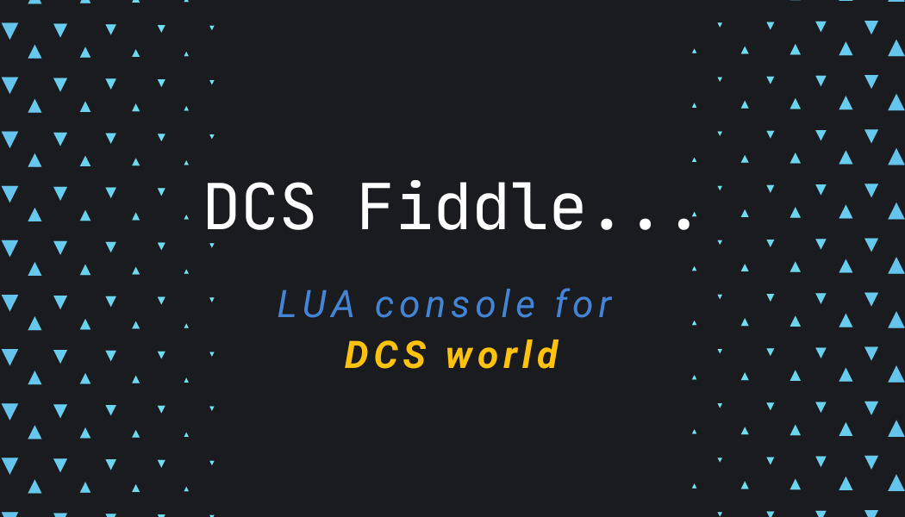

[](https://discord.gg/bT7BEHn5RD)
[](https://discord.com/channels/738118932937834566/1178991295260278785)
[](https://chat.openai.com/g/g-6643nUbup-tslua-dcs-codebot)
[](https://patreon.com/flyingdice)



# ⚛️ DCS Fiddle HTTP Server

This repository contains two HTTP servers designed to execute LUA scripts in DCS World, leveraging [tslua-dcs](https://tslua-dcs.pages.dev/) and [TypeScriptToLua](https://typescripttolua.github.io/). While primarily intended for integration with [DCS Fiddle](https://dcsfiddle.pages.dev/), these servers can also be used for other purposes.

## ✨ Features

- **Execute LUA scripts:** Easily run LUA scripts in DCS World.
- **RESTful API:** Interact via POST requests for seamless integration with tools and scripts.
- **Swagger Integration:** View and test API endpoints with OpenAPI specifications.

## 🔒 Prerequisites

To enable script execution, update your `MissionScripting.lua` file to allow access to `require` and `package` modules. Additionally, configure the LuaSocket package path as follows:

### 🔧 Updating `MissionScripting.lua`

Replace your `MissionScripting.lua` file content with the following code:

```lua
-- Initialization script for the Mission lua Environment (SSE)

dofile('Scripts/ScriptingSystem.lua')

-- Sanitize Mission Scripting environment
-- WARNING: The following configuration makes some functions available, potentially exposing risks.
-- Proceed with caution if using downloaded missions.

local function sanitizeModule(name)
    _G[name] = nil
    package.loaded[name] = nil
end

do
    sanitizeModule('os')
    sanitizeModule('io')
    sanitizeModule('lfs')
    -- _G['require'] = nil
    _G['loadlib'] = nil
    -- _G['package'] = nil
end

package.path = package.path .. ";.\\LuaSocket\\?.lua"
package.cpath = package.cpath .. ";.\\LuaSocket\\?.dll"
```

## ⚡️ Installation

Download the latest release from the [GitHub repository](https://github.com/flying-dice/dcsfiddle-server/releases).

- Add the `dcs-fiddle-main.lua` file to your DCS World `%USERPROFILE%\Saved Games\DCS\Scripts\Hooks` folder.
- Add the `dcs-fiddle-mission.lua` file to your DCS World `%USERPROFILE%\Saved Games\DCS\Scripts` folder.

[](https://dcs-dropzone-registry-viewer.pages.dev/#/dcs-fiddle)

## 🚀 Usage

When DCS starts it will load the `dcs-fiddle-main.lua` script, which will start the GUI HTTP server on port `12081`. 

```shell
curl -X GET --location "http://127.0.0.1:12081/health"
```

If the server is running, you will receive the following response:
```json
{"_APP_VERSION":"2.9.10.3948","version":"0.1.0","environment":"GUI","status":"OK","_VERSION":"Lua 5.1","_ARCHITECTURE":"x86_64"}
```

When a mission is loaded, the `dcs-fiddle-mission.lua` script will start the Mission HTTP server on port `12080`.

```shell
curl -X GET --location "http://127.0.0.1:12080/health"
```

If the server is running, you will receive the following response:

```json
{"_APP_VERSION":"2.9.10.3948","version":"0.1.0","environment":"MISSION","status":"OK","_VERSION":"Lua 5.1","_ARCHITECTURE":"x86_64"}
```

### 🔄 API Endpoints

1. **Health Check:**
    - Endpoint: `GET /health`
    - Use this endpoint to check if the server is running.

2. **Execute LUA Script:**
    - Endpoint: `POST /loadstring`
    - Accepts a base64-encoded LUA script in the request body and executes it.

### 📃 Example Requests

#### Execute LUA Script

Send a POST request to execute a LUA script. The script must be encoded in base64.

**Request:**

```bash
curl -X POST --location "http://127.0.0.1:12081/loadstring" \
    -H "Content-Type: text/plain" \
    -d 'cmV0dXJuICJVUCI='
```

**Response:**

The server returns the result of the LUA script in JSON format:

```json
"Caucasus"
```

#### Example 2: Get Coalition Side Table

**Request:**

```bash
curl --location --request POST 'http://127.0.0.1:12080/loadstring' \
--header 'Content-Type: text/plain' \
--data-raw 'cmV0dXJuIGNvYWxpdGlvbi5zaWRl'
```

**Response:**

```json
{ "NEUTRAL": 0, "BLUE": 2, "RED": 1 }
```

### 📊 OpenAPI Documentation

View the API documentation in a Swagger editor, such as [Swagger Petstore](https://petstore.swagger.io/), by navigating to:

- **Main:** https://petstore.swagger.io/?url=http://127.0.0.1:12081/v3/api-docs
- **Mission:** https://petstore.swagger.io/?url=http://127.0.0.1:12080/v3/api-docs

## 🔧 Local Development

This project is authored using [tslua-dcs](https://tslua-dcs.pages.dev/), enabling the development of LUA scripts in TypeScript.

### ⏳ Hot Reloading for Development

To test the project locally without restarting DCS:

1. Install the [DCS Hot Loader](https://github.com/flying-dice/dcs-hot-loader).
2. Use the following commands for rapid iteration:

```bash
npm run build && npm run deploy
```

## 📃 Available Scripts

The following `package.json` scripts are available for this project:

- **`build`**: Cleans the `dist` folder and builds both main and mission files.
  ```bash
  npm run build
  ```
- **`build:main`**: Builds the main server script using `tsconfig.tstl-main.json`.
  ```bash
  npm run build:main
  ```
- **`build:mission`**: Builds the mission script using `tsconfig.tstl-mission.json`.
  ```bash
  npm run build:mission
  ```
- **`deploy`**: Deploys both the main server and mission scripts.
  ```bash
  npm run deploy
  ```
- **`deploy:main`**: Deploys the main server script.
  ```bash
  npm run deploy:main
  ```
- **`deploy:mission`**: Deploys the mission script.
  ```bash
  npm run deploy:mission
  ```

## ⚠️ Troubleshooting

- **Server not starting:** Ensure all dependencies are installed and the required ports are not in use, ensure the MissionScripting.lua file is correctly configured.
- **Script execution errors:** Verify that the LUA script is properly encoded in base64 and adheres to DCS scripting requirements.

## 📜 License

This project is licensed under the MIT License. See the `LICENSE` file for details.

