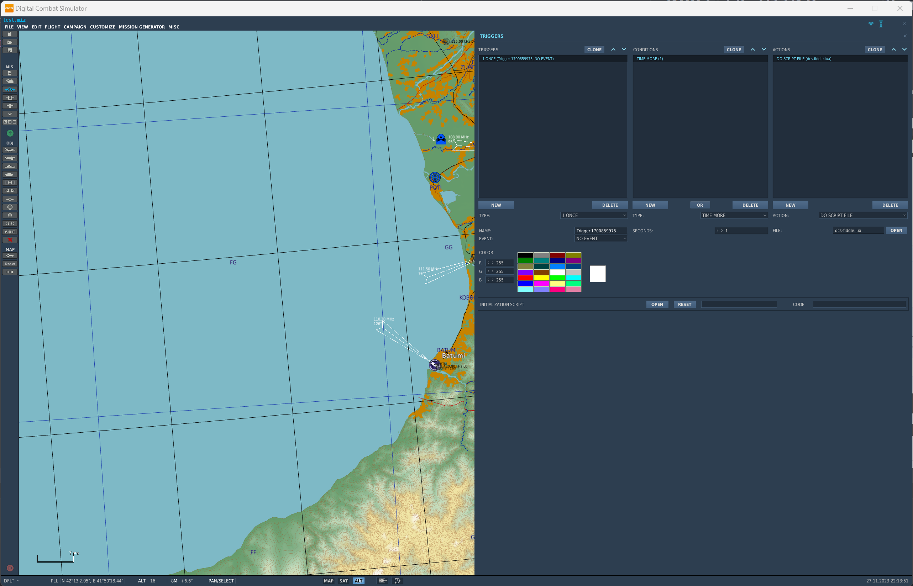
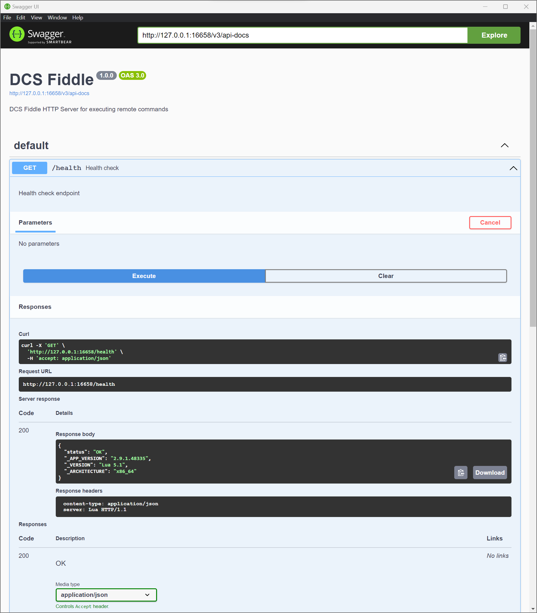
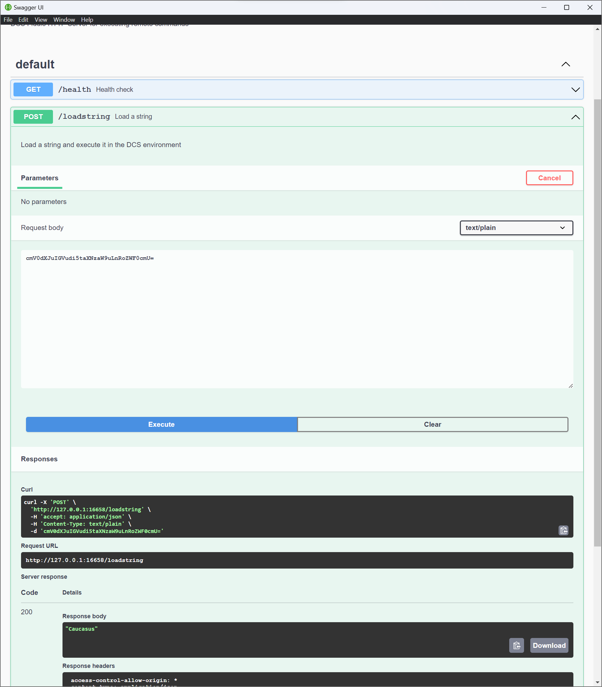

# DCS Fiddle HTTP Server written using tslua-dcs and TypescriptToLua

This repo contains a HTTP server that can be used to execute LUA scripts in DCS World.

Its main purpose is to allow the execution of LUA scripts using https://develop.dcsfiddle.pages.dev/ but it can be used for other purposes.

This is a minimal example of how to use the [tslua-dcs](https://github.com/flying-dice/tslua-dcs) to author a LUA script that can be executed in DCS World using Typescript.

## Usage

Download the lua bundle from `dist/dcs-fiddle.lua` and create a new mission in the DCS Mission Editor. Add a trigger with the following settings:



This will start the HTTP server on a loop on port 16658 listening on 127.0.0.1.

Open the HTTP Server OpenAPI spec at http://127.0.0.1:16658/v3/api-docs using a swagger editor i.e. https://petstore.swagger.io/

Or import the spec into Postman.

You will see the HTTP server exposes 2 endpoints, a health endpoint:



And a loadstring endpoint:



The Body of the post request should contain a LUA script that MUST return a value, it will be loaded and executed and the response will be returned
as a JSON body.

For example the following request will return the string "Caucasus":

```shell
curl --location --request POST 'http://127.0.0.1:16658/loadstring' \
--header 'Content-Type: text/plain' \
--data-raw 'cmV0dXJuIGVudi5taXNzaW9uLnRoZWF0cmU='
```

```json
"Caucasus"
```

The following request will return the coalition side table:

```shell
curl --location --request POST 'http://127.0.0.1:16658/loadstring' \
--header 'Content-Type: text/plain' \
--data-raw 'cmV0dXJuIGNvYWxpdGlvbi5zaWRl'
```

```json
{ "NEUTRAL": 0, "BLUE": 2, "RED": 1 }
```
